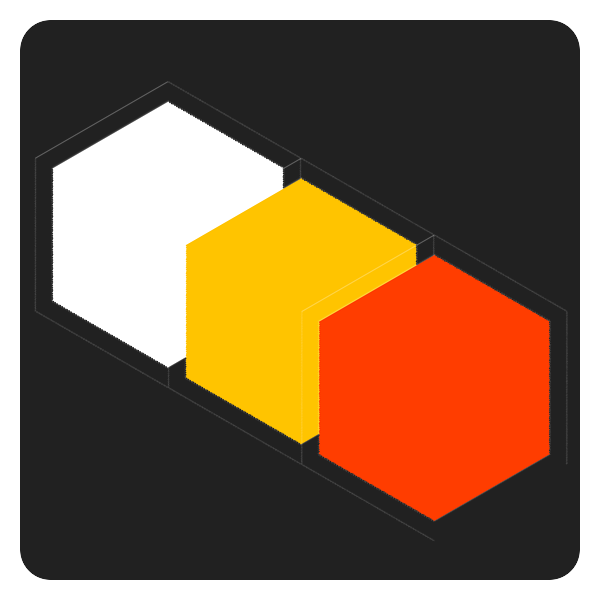

# NSGen

<p align="center">

</p>

## A *project structure generator* for your NodeJS backend, based on your configurations and common best-practices

### [Check out the full documentation](https://lykos94.github.io/nsgen/)

---

You create a simple configuration file, NSGen takes care of creating an entire project based on express in NodeJS. Among other features, there are the following:

- Creation of Data Models that define the structure of your database
- Automatic generation of routes and APIs you need
- Creation of the main services for your Data Model

## You're off to a better start

An example can be more explanatory than a thousand words (or was it a picture...?). Below you can see the file from which you can start:

```yaml
config:
  name: my-application
  description: Backend for my-application
  db:
    name: testdb
    username: john
    password: s3cr3t
    type: mysql
model:
  user:
    username:
      type: string
      null: false
    password:
      type: string
  article:
    title: string
    description:
      type: text
    published:
      type: date
api:
  users:
    crud: true
    model: user
  articles:
    model: article
    get:
    post:
    put:
```

...and that's it! Build directly with

```bash
$ nsgen --config config.yaml
```

and this will be the resulting structure of your project:

```bash
└── 📁 my-application
    ├── 📁 api
    │   ├── 🗒 index.ts
    │   ├── 🗒 post.ts
    │   └── 🗒 users.ts
    ├── 📁 config
    │   └── 🗒 index.ts
    ├── 📁 models
    │   ├── 🗒 article.ts
    │   └── 🗒 user.ts
    ├── 🗒 index.ts
    ├── 🗒 .env
    ├── 🗒 .gitignore
    ├── 🗒 package.json
    ├── 🗒 README.md
    ├── 🗒 sequelize.ts
    └── 🗒 tsconfig.json
```

Install all the required dependencies and compile:

```bash tab="YARN"
$ yarn
$ tsc
```

```bash tab="NPM"
$ npm install
$ tsc
```

That's right. You don't have to do anything else, just start your new server.

```bash
$ node dist/index.js
```
